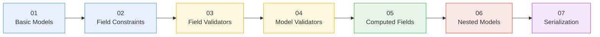

<div align="center">

# 🩺 Pydantic Patient System

**A progressive, hands-on tour of Pydantic v2 — one domain model, seven concepts, zero fluff.**

[](https://www.python.org/)
[](https://docs.pydantic.dev/)
[](#honest-take)

</div>

---

## What this is

Seven small, runnable scripts that build **one `Patient` model** up in layers — instead of seven disconnected snippets, each concept is added on top of the last so you can see how they compose in a real model.

Coded along with a Pydantic tutorial, then cleaned up, documented, and finished: two files (`06`, `07`) were deliberately left as exercises and are filled in here.

```
No validation logic → constrained fields → custom rules → cross-field rules
   → derived fields → nested models → controlled output
```

## Learning path



## Quick start

```bash
git clone https://github.com/<your-username>/pydantic-patient-system.git
cd pydantic-patient-system
pip install -r requirements.txt

python 01_basic_models.py   # ...through...
python 07_serialization.py
```

Every script prints a **valid** run and then a **deliberately invalid** one, so the `ValidationError` output sits right next to the concept that produces it.

## The scripts

<details open>
<summary><b>01 · Basic Models</b> — <code>01_basic_models.py</code></summary>

<br>

The minimum viable model: annotate a class, get validation and coercion for free.

| Idea | API |
|---|---|
| Define a model | `BaseModel` |
| Automatic type coercion | `"20"` → `20` |
| Reject what can't be coerced | `ValidationError` |

</details>

<details>
<summary><b>02 · Field Constraints</b> — <code>02_field_constraints.py</code></summary>

<br>

Attach rules and metadata to individual fields — bounds, lengths, defaults, and format validation.

| Idea | API |
|---|---|
| Constraints + metadata | `Field(gt=, lt=, max_length=, title=, description=)` |
| Format validation | `EmailStr`, `AnyUrl` |
| Turn off coercion | `strict=True` |

</details>

<details>
<summary><b>03 · Field Validators</b> — <code>03_field_validators.py</code></summary>

<br>

Business rules that go beyond type-checking — reject or transform a single field's value.

| Idea | API |
|---|---|
| Custom per-field rule | `@field_validator("email")` |
| Reject on a business rule | approved-domain allow-list |
| Transform on the way in | name → uppercase |

</details>

<details>
<summary><b>04 · Model Validators</b> — <code>04_model_validators.py</code></summary>

<br>

Rules that need more than one field at once — `@field_validator` can't see across fields, this can.

| Idea | API |
|---|---|
| Cross-field rule | `@model_validator(mode="after")` |
| Example rule | over-60 patients must have an emergency contact |

</details>

<details>
<summary><b>05 · Computed Fields</b> — <code>05_computed_fields.py</code></summary>

<br>

Values derived from other fields, exposed as if they were real ones — always in sync, never settable directly.

| Idea | API |
|---|---|
| Derived, read-only field | `@computed_field` + `@property` |
| Example | BMI from `weight` + `height` |
| Shows up in output | `.model_dump()` includes `bmi` |

</details>

<details>
<summary><b>06 · Nested Models</b> — <code>06_nested_models.py</code> <sub><i>(written for this repo)</i></sub></summary>

<br>

Real data isn't flat. A model can contain other models, and validation recurses through every level.

| Idea | API |
|---|---|
| Model inside a model | `address: Address` |
| Collection of nested models | `emergency_contacts: List[EmergencyContact]` |
| Precise nested errors | e.g. `address.postal_code` |

</details>

<details>
<summary><b>07 · Serialization</b> — <code>07_serialization.py</code> <sub><i>(written for this repo)</i></sub></summary>

<br>

Turning a validated model back into a dict or JSON, with control over what leaves the model and under what name.

| Idea | API |
|---|---|
| To dict / to JSON | `.model_dump()` / `.model_dump_json()` |
| Partial output | `include={...}` / `exclude={...}` |
| Only what the caller set | `exclude_unset=True` |
| Rename on the way out | `Field(alias=...)` + `by_alias=True` |

</details>

## Project structure

```
pydantic-patient-system/
├── 01_basic_models.py
├── 02_field_constraints.py
├── 03_field_validators.py
├── 04_model_validators.py
├── 05_computed_fields.py
├── 06_nested_models.py
├── 07_serialization.py
├── requirements.txt
└── README.md
```

## Honest take

This is a learning repo, not a library — the point was to internalize Pydantic v2's mechanics by rebuilding one example incrementally, not to ship something novel.

- The domain (patient records) is deliberately simple so Pydantic stays the focus, not the domain logic.
- `06` and `07` weren't part of the original tutorial — they were left as an exercise, and the repo felt incomplete without them, so they're filled in here.
- There's no test suite. Each script's `if __name__ == "__main__":` block is an inline smoke test — fine for a learning repo, not a substitute for real tests in anything shipped.

## Requirements

- Python 3.10+
- `pydantic` v2
- `email-validator` (required for `EmailStr`)

## License

Use this however is useful to you.
